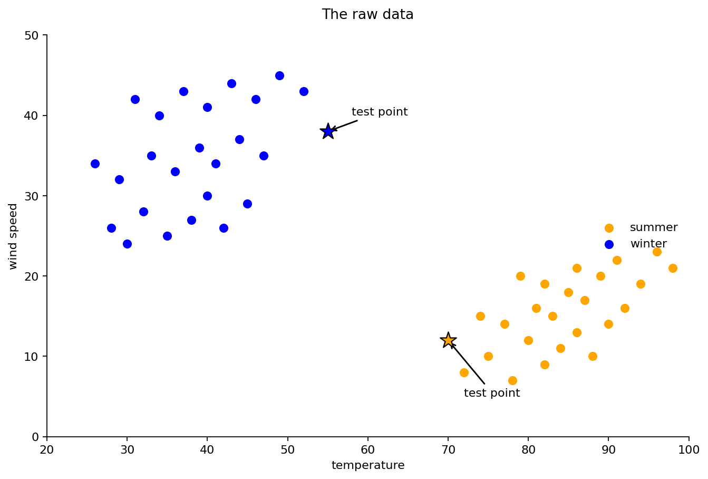
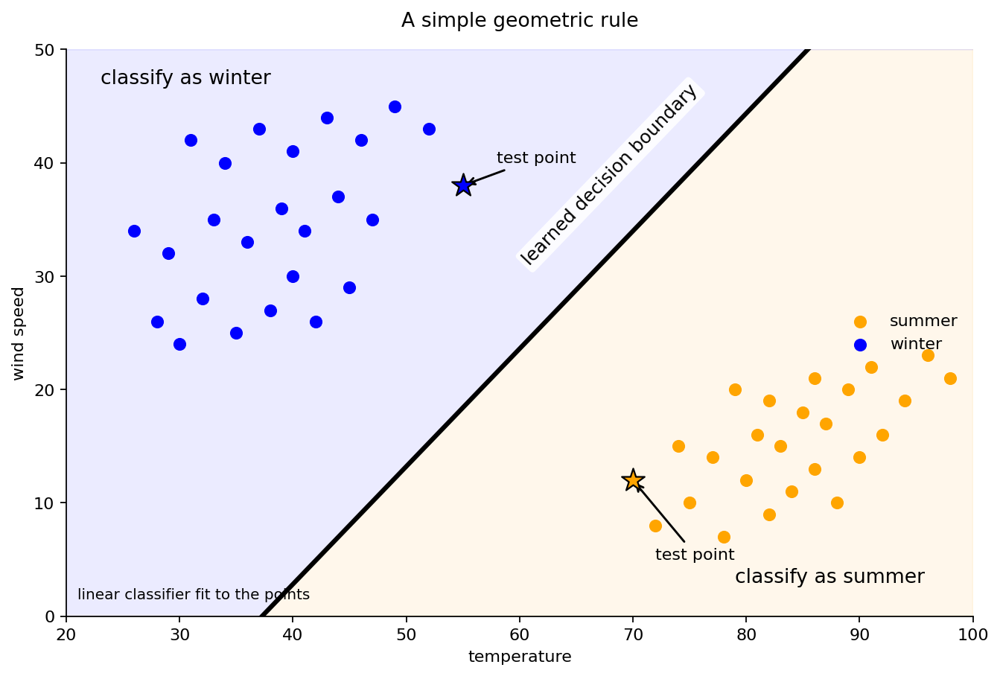
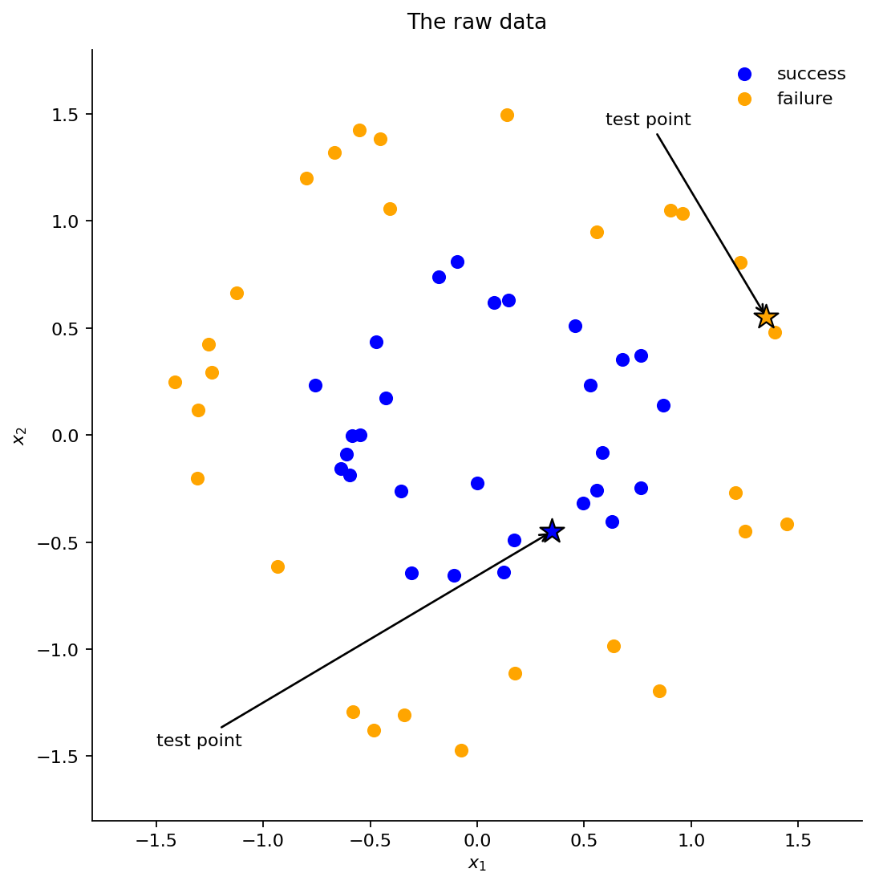
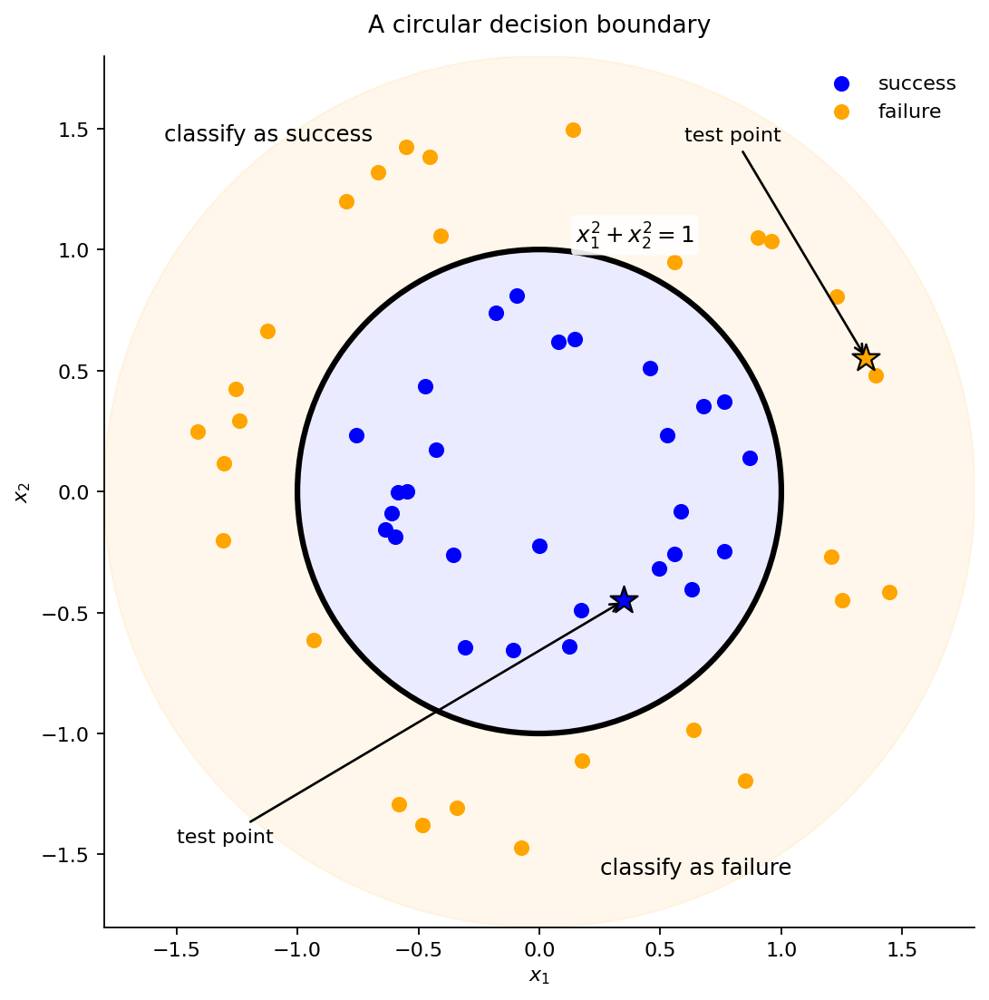
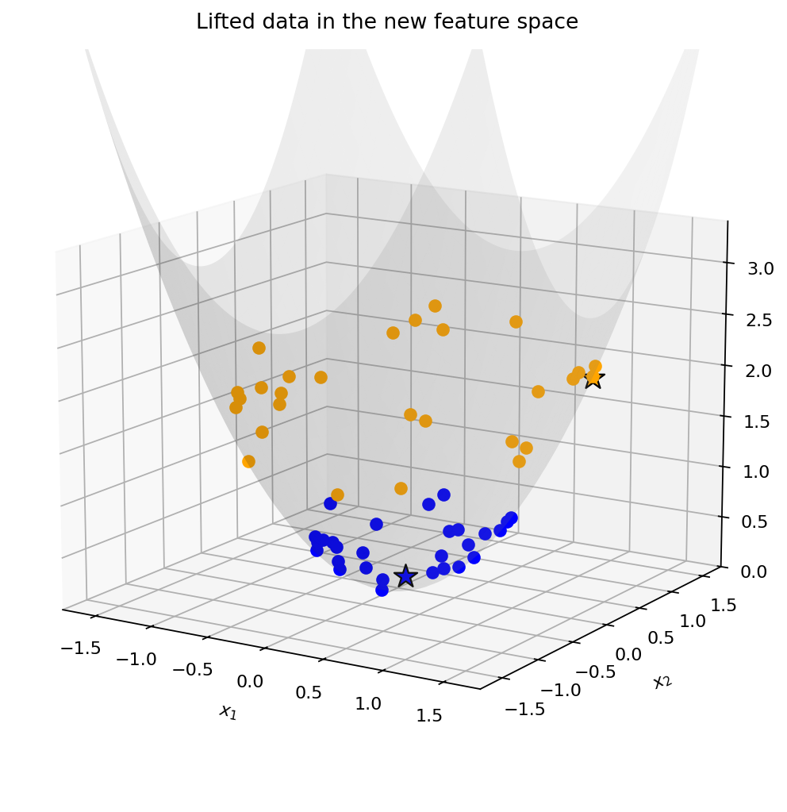
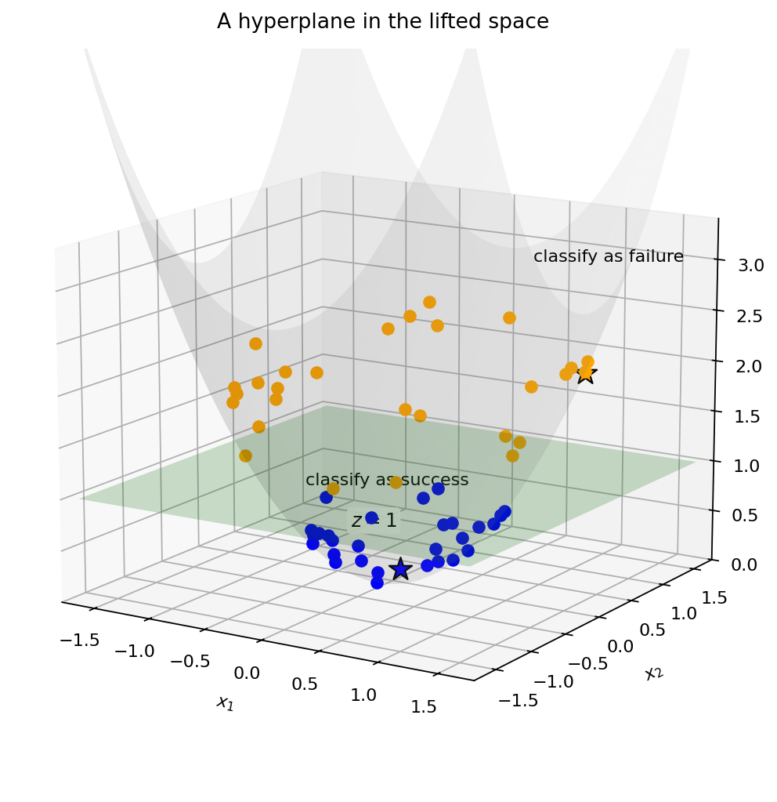
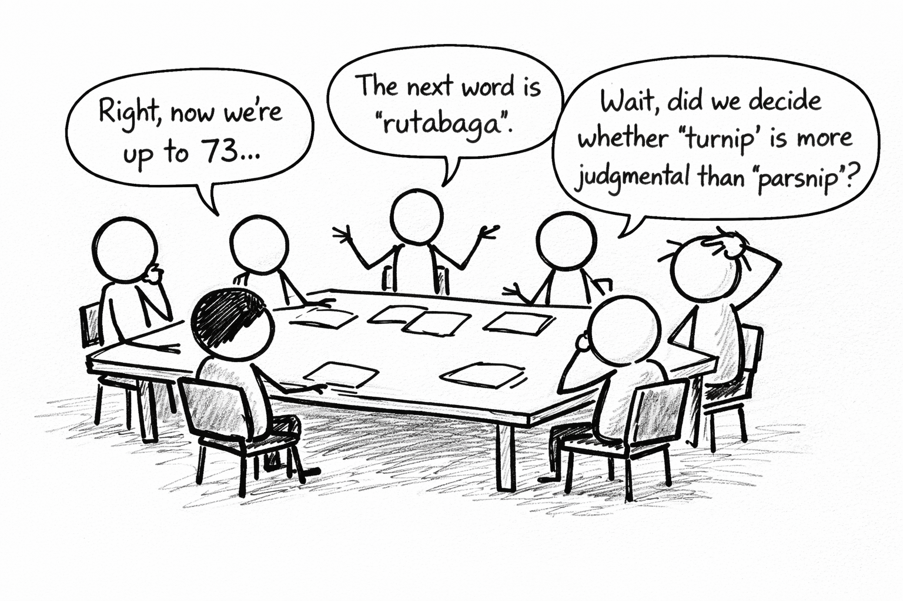

## A question I hear a lot

How does AI work?

::: {.fragment .fade-in}
After all, computers are unbelievably stupid!
:::

## For example

A human can see exactly what this chunk of Python code means:

```         
student = {
    "name": "Alice",
    "score": 97
    "passed": True,
}

print(student)
```

::: {.fragment .fade-in}
But Python does not say "close enough":

```         
File "example.py", line 4
    "score": 97
             ^
SyntaxError: invalid syntax.
```
:::

::: {.fragment .fade-in}
Computers do not do what you mean. They do what you say.
:::

## So if computers are so dumb...

::: {.fragment .fade-in}
Then how did we get them to...

-   reason about language?\
-   recognize images?\
-   generate believable videos from a text description?
-   and so on?
:::

::: {.fragment .fade-in}
The answer you'll hear: we let them learn from data, and miracles ensue.
:::

## No miracles. Only math.

Before a machine can learn from words or images, those objects must first be turned into something mathematics can work with.

That is the real foundation for the "miracle."

::: {.fragment .fade-in}
My goal today: give you some sense of how that works, and what happens next.

-   **Vector factories:** how we represent words, pictures, and sounds as vectors in Euclidean space\
-   **Hyperplanes:** how we use simple geometric boundaries in that space to sort, separate, and make decisions
:::

## A first geometric question

Suppose we observe the weather every day and record two features:

-   $x_1$ = temperature
-   $x_2$ = max wind speed

Can we draw a boundary in this 2D feature space that separates:

-   summer days ($y=1$), versus
-   winter days ($y=0$)?

This is a simple **classification** problem.

## The raw data

{fig-alt="The raw weather data" width="90%" fig-align="center"}

## The linear decision boundary

{fig-alt="A linear decision boundary" width="90%" fig-align="center"}

## A simple decision boundary

A line like this is called a **linear decision boundary**.

In higher dimensions, the same idea becomes a plane, or more generally a **hyperplane**.

For a point $x \in \mathbb{R}^d$, we compute

$$
w^\top x + b
=
w_1x_1 + w_2x_2 + \cdots + w_dx_d + b.
$$

The sign of this number tells us which side of the boundary $x$ lies on.

## Why do we like linear rules?

-   **Simple:** easy to describe and interpret
-   **Trainable:** easy to differentiate and so easy to optimize
-   **Fast:** modern hardware is extremely good at linear algebra, even in super high dimensions

::: {.fragment .fade-in}
{fig-alt="A linear decision boundary" width="52%" fig-align="center"}
:::

## A problem a line cannot solve

Imagine a drone trying to land on a circular charging pad.

For each landing attempt, record

-   $x_1$: horizontal error from the center
-   $x_2$: vertical error from the center

We want a decision rule:

-   **success** if the landing is close enough to the center
-   **failure** if it lands too far away

## The raw data

{width="100%" fig-align="center"}

## The right boundary in this space

{width="100%" fig-align="center"}

## Problem: not linear

The natural rule is based on radial distance from the center:

$$
x_1^2 + x_2^2 > 1
$$

This is a nonlinear decision boundary. No line separates the classes.

We like this a lot less:

-   Much harder to search for good nonlinear boundaries in high-dimensional feature spaces
-   Much harder to optimize and deploy efficiently at scale

## Solution: add a new feature

Introduce a third coordinate:

$$
x_3 = x_1^2 + x_2^2.
$$

Now lift each point from

$$
\mathcal{X} = (x_1,x_2) \quad \text{to} \quad \mathcal{X}' = (x_1,x_2,x_3).
$$

In the lifted space:

-   Points near the center have small $x_3$.
-   Points farther out have larger $x_3$.

## The points in lifted space

{width="100%" fig-align="center"}

## A separating hyperplane

{width="100%" fig-align="center"}

## The lesson of the lifting trick

The hyperplane was not the hard part.

The hard part was inventing the right new feature:

$$
x_3 = x_1^2 + x_2^2.
$$

Once we had that feature, the separation became easy.

::: {.fragment .fade-in}
But in real problems, the right features are usually not obvious.
:::

## The real bottleneck

For words, images, and sounds, we usually do **not** know in advance

-   which coordinates matter
-   which transformations make the data separable
-   which geometric directions will be useful

That is the hard part: building the right representation.

## So where do good coordinates come from?

In machine learning, we need systematic ways to construct good coordinates:

-   for making similar things land near each other
-   for making useful patterns visible
-   for making simple decision rules, like hyperplanes, actually work

It's not obvious where to start if our data points aren't numbers!

::: {.fragment .fade-in}
That's the harder half of today's story: **vector factories,** or ways of turning messy objects into useful coordinates.
:::

## Many data types, many vector factories

There is no single universal recipe for turning data into vectors.

Different kinds of objects usually need different pipelines:

- text
- images
- audio
- video

All of them aim at the same goal: turn messy objects into Euclidean vectors, so that geometry becomes useful.

::: {.fragment .fade-in}
Today, we'll focus on **text**.
:::

## Let's play a game

I'm thinking of a person, place, or thing.

You may ask only yes-or-no questions.

Can you guess what I’m thinking of?

##  {background-image="fig/scrooge.jpg" background-size="cover" background-position="center"}

::: {style="position: absolute; bottom: 30px; right: 40px; color: white; font-size: 0.8em;"}
The answer: Ebenezer Scrooge
:::

## The Muppet version



## What have we done here?

Let $\mathcal{X}$ be our original space of objects (people/places/things). Our "vector factory" consists of $N$ binary features

$$
f_1, \dots, f_N, \qquad f_i : \mathcal{X} \to \{0,1\}.
$$

Each feature asks one yes/no question about the input word $x$. Together they define the mapping

$$
\Phi : \mathcal{X} \to \{0,1\}^N,
\qquad
\Phi(x) = \bigl(f_1(x), \dots, f_N(x)\bigr).
$$

We have *embedded* our original space $\mathcal{X}$ into the binary cube $\{0,1\}^N$.

## In the "Muppet Christmas Carol" coordinates

| question                   | Scrooge |
|----------------------------|--------:|
| vegetable                  |       0 |
| mineral                    |       0 |
| animal                     |       1 |
| found on a farm            |       0 |
| found in the city          |       1 |
| pulls a taxi cab           |       0 |
| bear                       |       0 |
| unwanted creature          |       1 |
| a rat, leech, or cockroach |       0 |

\vspace{1em}

So we can represent "Scrooge" by the vector $(0,0,1,0,1,0,0,1,0)$

## Why the binary cube is awkward

In "20 questions", our embedding space is the binary cube. Two problems appear immediately.

::: {.fragment .fade-in}
First, some questions don't have binary answers.

-   Is Scrooge a bear? Not literally, but sort of.
-   Is he an unwanted creature? Seemingly so... but not to the woman he almost married as a young man.
:::

## Dickens knew this

> “I have found it out! I know what it is, Fred! I know what it is!” “What is it?” cried Fred.\
> “It’s your Uncle Scro-o-o-o-oge!”
>
> Which it certainly was. Admiration was the universal sentiment, though some objected that the reply to “Is it a bear?” ought to have been “Yes;” inasmuch as an answer in the negative was sufficient to have diverted their thoughts from Mr. Scrooge, supposing they had ever had any tendency that way.

::: {style="text-align: right; margin-top: 1em; font-size: 0.8em;"}
— Charles Dickens, <i>A Christmas Carol</i>
:::

## Why the binary cube is awkward

Second, we'd like to use math to:

-   compare word meanings
-   average similar examples
-   let data discover patterns and directions

::: {.fragment .fade-in}
But $\{0,1\}^N$ is nothing but corners.

-   averages leave the space
-   there is no natural notion of "between" (not convex)

So basic math operations push us outside $\{0,1\}^N$. We'd prefer a space that supports both *meaning* and *math*.
:::

##  {background-image="fig/binary_cube_convex_hull.png" background-size="cover" background-position="center"}

## Scrooge in real-valued Muppet coordinates

| question                   | Scrooge |
|----------------------------|--------:|
| vegetable                  |    0.10 |
| mineral                    |    0.00 |
| animal                     |    0.75 |
| found on a farm            |    0.00 |
| found in the city          |    0.95 |
| pulls a taxi cab           |    0.00 |
| bear                       |    0.60 |
| unwanted creature          |    0.85 |
| a rat, leech, or cockroach |    0.15 |

## More words in real-valued Muppet coordinates

| question | Scrooge | Rafael Nadal | Winnie-the-Pooh | New York City |
|----|---:|---:|---:|---:|
| vegetable | 0.10 | 0.00 | 0.15 | 0.00 |
| mineral | 0.00 | 0.10 | 0.00 | 0.30 |
| animal | 0.75 | 0.85 | 0.90 | 0.15 |
| found on a farm | 0.00 | 0.05 | 0.20 | 0.00 |
| found in the city | 0.95 | 0.60 | 0.10 | 1.00 |
| pulls a taxi cab | 0.00 | 0.00 | 0.00 | 0.30 |
| bear | 0.60 | 0.30 | 0.90 | 0.00 |
| unwanted creature | 0.85 | 0.05 | 0.00 | 0.20 |
| a rat, leech, or cockroach | 0.15 | 0.00 | 0.00 | 0.40 |

## Another problem

20 questions is adaptive.

Later questions depend on earlier answers.

-   If the answer to “animal” is yes, I ask one kind of next question.
-   If the answer to “city” is yes I ask a very different one.
-   Different targets lead to different paths through the game.

## Another problem

But an embedding needs a **fixed coordinate system**.

Every word must be mapped into the same space:

$$
\Phi(w) \in \mathbb{R}^d
$$

with the same $d$ coordinates for every word.

## Muppet coordinates aren't great for this

| coordinate                 | concerto | algorithm | rainbow |
|----------------------------|---------:|----------:|--------:|
| vegetable                  |        0 |         0 |       0 |
| mineral                    |        0 |         0 |       0 |
| animal                     |        0 |         0 |       0 |
| found on a farm            |        0 |         0 |       0 |
| found in the city          |        0 |         0 |       0 |
| pulls a taxi cab           |        0 |         0 |       0 |
| bear                       |        0 |         0 |       0 |
| unwanted creature          |        0 |         0 |       0 |
| a rat, leech, or cockroach |        0 |         0 |       0 |

::: {.fragment .fade-in}
Whole regions of meaning are invisible to these chosen questions.
:::

## The real challenge

We need a fixed set of, say, 500 questions that is sufficiently rich to encode the meaning of *all* words.

::: {.fragment .fade-in}
**How?**
:::

## Option 1: BOGSAT

{fig-alt="Cartoon of a BOGSAT meeting" width="90%" fig-align="center"}

## Option 2: Let the computer choose

This is precisely what's done in practice.

::: {.fragment .fade-in}
But what kinds of questions could a computer even choose?
:::

## Can you guess the missing word?

-   He wiped a streak of \_\_\_ off the corner of his mouth.
-   Could you pass the \_\_\_ for the fries?
-   The burger came with lettuce, onion, pickles, and \_\_\_.
-   He got \_\_\_ all over the plate when he squeezed the bottle too hard.
-   There was a half-empty bottle of \_\_\_ next to the salt and pepper.

::: {.fragment .fade-in}
Notice what you just did.

You did not identify the word as "ketchup" by answering philosophical questions like “is it judgmental?”

You identified it from the company it keeps.
:::

## What questions can a computer ask?

A computer does not understand “ketchup” the way we do.

But if you give it access to every English sentence ever digitized, it can ask statistical questions like:

-   Does this word often appear near **fries**?
-   Does it often appear near **burger**?
-   Does it often appear near **bottle**?
-   Does it often appear near **salt** or **pepper**?
-   Does it often appear in the context **pass the** \_\_\_?

These are not philosophical questions. They are questions about **co-location statistics**.

## From contexts to coordinates

For each word, we record how often it appears near context words like

$$
\text{fries},\ \text{burger},\ \text{bottle},\ \text{salt},\ \text{pepper},\dots
$$

So instead of hand-designed features, we get data-driven coordinates:

$$
\text{ketchup} \mapsto
(\text{freq near fries},\ \text{freq near burger},\ \text{freq near bottle},\dots)
$$

Now the coordinates come from usage patterns in text.

## But which context questions?

We still face a problem:

-   near **fries**?
-   near **burger**?
-   near **bottle**?
-   near **diner**?
-   near **mustard**?
-   near **tomato**?
-   near **plate**?

If we hand-design context questions, we're back to BOGSAT.

## The modern idea

Don't write the questions down explicitly.

Instead:

-   assign each word an unknown vector.
-   look at nearby words in real sentences: the *context window*
-   train a model to predict a missing or next word: "Could you pass the \_\_\_ for the fries?"

If the model gets good at using vectors of nearby words to predict the missing word, those vectors must be capturing useful information.

## Key ingredient 1: word vectors

Let $\mathcal V$ be the vocabulary.

For each word $w \in \mathcal V$, we introduce an unknown vector

$$
v_w \in \mathbb{R}^d.
$$

These vectors are not given to us in advance.

They are parameters to be learned from data.

## Key ingredient 2: a prediction function

We also must train a prediction function

$$
f_\theta : \mathbb{R}^{md} \to \mathbb{R}^{|\mathcal V|},
$$

where

-   $m$ = number of words in the context window
-   $d$ = dimension of each word vector
-   $|\mathcal V|$ = size of the vocabulary

The input is the sequence of vectors $v_1, \ldots, v_m$ for the $m$ nearby words.

The output is a score for every possible target word in English.

## More about this function...

Suppose

-   each word vector has dimension $d = 100$
-   we look at $m = 10$ nearby words
-   the vocabulary has size $|\mathcal V| = 50{,}000$

Then the model is a function

$$
f_\theta : \mathbb{R}^{10 \times 100} \to \mathbb{R}^{50{,}000}.
$$

Input: the 10 nearby words, each represented by a vector in $\mathbb{R}^{100}$

Output: 50,000 scores, one for each possible word in the vocab.

## The machine learning problem

We then train **both**

-   the word vectors $v_w$
-   the prediction function's parameters $\theta$

The model rewards combinations of $\theta$ and the $v_w$'s that generate:

-   high scores for the right word: "Could you pass the **ketchup** for the fries?"
-   low scores for wrong words: "Could you pass the **Immanuel Kant** for the fries?"

## Publicly disclosed frontier scale

Toy example:

$$
10 \text{ words} \times 100 \text{ dimensions}
\quad\longrightarrow\quad
50{,}000 \text{ possible outputs}
$$

Publicly disclosed real systems (Llama 4, Gemma 3, OpenAI gpt-oss)

-   $128\text{K}$ token context windows are now standard in major open models
-   output vocabularies are often around $200\text{K}$ to $260\text{K}$ tokens
-   some frontier systems have context windows up to $10\text{ million}$ tokens

Same basic game, wildly larger scale, e.g. $$
f_\theta : \mathbb{R}^{128{,}000 \times 4096} \to \mathbb{R}^{260{,}000}
$$

## What might $f_\theta$ even look like?

Usually not one giant formula.

Instead, think of a composition

$$
f_\theta = f^{(L)} \circ f^{(L-1)} \circ \cdots \circ f^{(1)}
$$

of many simpler functions.

A typical layer looks like

$$
x \mapsto \sigma(Ax+b),
$$

where $A$ is a matrix, $b$ is a bias vector, and $\sigma$ is a simple nonlinearity.

## Linear rules again

So even a huge model is built from familiar ingredients:

-   matrix-vector multiplication
-   affine maps
-   simple nonlinearities
-   repeated many times

Linear decision rules have not disappeared.

They have been layered, recombined, and lifted into richer spaces.


## The moral

The real trick is usually not the prediction rule (e.g. a linear boundary).  

It is finding the representation in which a simple rule becomes possible.

That is the partnership at the heart of modern machine learning:

- **Vector factories** build the space  
- **Hyperplanes** make the space useful

::: {.fragment .fade-in}
Thank you all!
:::


## Bonus: the basic training objective

Suppose a training sentence is

$$
w_1, w_2, \dots, w_T.
$$

An autoregressive model factors its probability as

$$
P(w_1,\dots,w_T)
=
P(w_1)\prod_{t=1}^{T-1} P(w_{t+1}\mid w_1,\dots,w_t).
$$

So one length-$T$ sequence gives us $T-1$ prediction tasks.  We train the model on **trillions** of such sequences.  

## Bonus: the loss function

Training tries to make the observed next word likely.

So we maximize the log-likelihood

$$
\sum_{t=1}^{T-1}\log P_\theta(w_{t+1}\mid w_1,\dots,w_t),
$$

or equivalently minimize the negative log-likelihood

$$
\mathcal L(\theta)
=
-\sum_{t=1}^{T-1}\log P_\theta(w_{t+1}\mid w_1,\dots,w_t).
$$


## Bonus: from words to vectors

Each vocabulary item $w$ gets a trainable embedding vector

$$
v_w \in \mathbb{R}^d.
$$

So an input sequence

$$
w_1,\dots,w_T
$$

becomes a sequence of vectors

$$
v_{w_1},\dots,v_{w_T}.
$$

These vectors are learned jointly with the rest of the model.

## Bonus: contextualization

Those raw word vectors are not yet context-sensitive.

So we pass them through many "self-attention" blocks:

$$
(v_1,\dots,v_T)
\longmapsto
(h_1^{(1)},\dots,h_T^{(1)})
\longmapsto \cdots \longmapsto
(h_1^{(L)},\dots,h_T^{(L)}).
$$

Each layer updates every vector using information from the surrounding words.


## Bonus: what self-attention is doing

At position $t$, the model forms a new vector by mixing information from earlier positions:

$$
h_t' = \sum_{s \le t} \alpha_{ts} \, M h_s.
$$

Here

- the coefficients $\alpha_{ts}$ say how much position $t$ attends to position $s$
- the matrix $M$ linearly transforms the vectors before mixing

So each new vector is a weighted combination of context-aware linear transforms of earlier vectors.

## Bonus: from the final layer to next-word scores

After the last self-attention block, we have final vectors

$$
h_1,\dots,h_T.
$$

To predict the next word after the context $w_1,\dots,w_T$,
we use the last vector $h_T$ and compute

$$
z = W_{\mathrm{out}} h_T + b,
$$

where

$$
z \in \mathbb{R}^{|\mathcal V|}.
$$

So we get one score for every possible completion word.

## Bonus: from scores to probabilities

The score vector

$$
z \in \mathbb{R}^{|\mathcal V|}
$$

is turned into a probability distribution by softmax:

$$
P_\theta(w \mid w_1,\dots,w_T)
=
\frac{e^{z_w}}{\sum_{u \in \mathcal V} e^{z_u}}.
$$

So the model assigns a probability to every possible next word.

## Bonus: what is learned?

Training adjusts both

- the embedding vectors $v_w$
- the internal parameters of the self-attention blocks
- the final output map $W_{\mathrm{out}}, b$

so that real next words get high probability
and implausible completions get low probability.


## Bonus: the whole pipeline

$$
\begin{aligned}
w_1,\dots,w_T
&\longrightarrow
v_{w_1},\dots,v_{w_T} \\
&\longrightarrow
h_1,\dots,h_T \\
&\longrightarrow
W_{\mathrm{out}} h_T + b \\
&\longrightarrow
P_\theta(\text{next word}\mid w_1,\dots,w_T)
\end{aligned}
$$

So the model learns both

- a vector space for words
- and a giant compositional function acting on sequences of those vectors

## Bonus: same story, more machinery

Even here, the basic picture has not changed.

We still have:

- vectors representing words
- linear algebra doing most of the work
- simple nonlinearities and normalization
- a final scoring rule over possible outputs

The machinery is elaborate.

The geometric story is the same.


